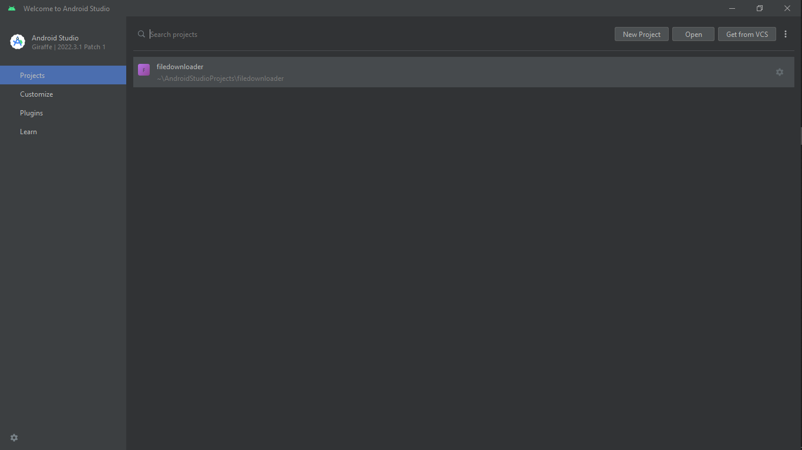

Go to the Version Repository of the App and download the compressed RAR file 
Unzip the Compressed File  
Open the File with Android Studio do some if any errors check if there's any missing Resource and Download it, 
Config. if needed and Then Debug the code and Run it on your Device/Emulator  
<h3>Steps:</h3>

  

Open Android Studio>New Project>(Select the Unzipped File and make sure to open Project's root directory)
  

  

